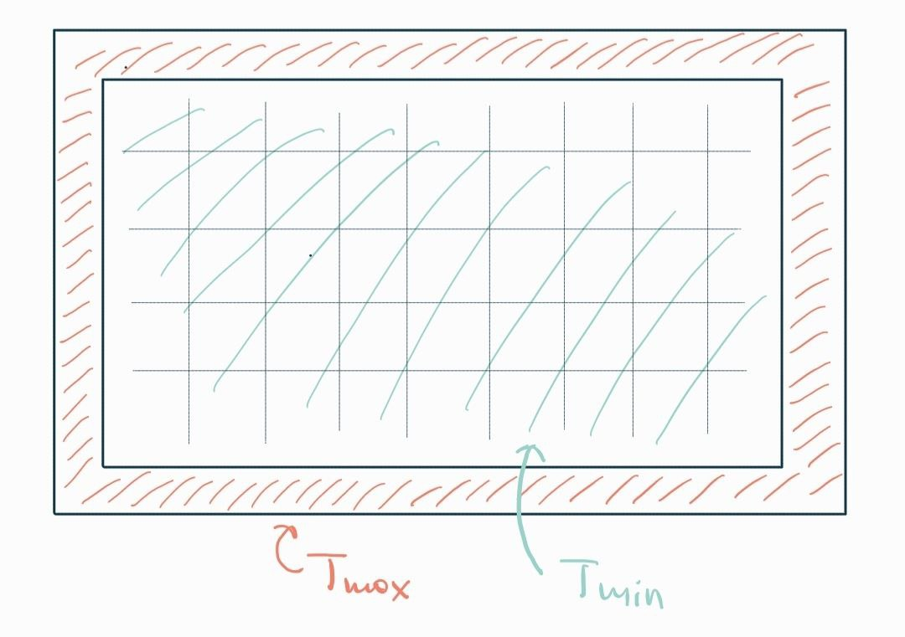

# Thermal-conductivity

## Что это за беспредел?
ПРОГРЕВ - это 1D и 2D симуляция теплопроводности. Пользователь задаёт начальные условия, а затем наблюдает за процессом изменения температуры в системе.
Программа позволяет получать температурные данные из любой точки расчётной области в любой момент времени (только для 2D-cимуляции).

## Как это запускать?
Для запуска лучше использовать Linux. В консоли необходимо последовательно выполнить следующие шаги:
  1. Для запуска проекта необходима библиотека SFML, устанавливаемая командой `sudo apt-get install libsfml-dev`.
  2. Также необходим CMake: `sudo apt-get install cmake`
  3. Создаём папку, в которую склонируем проект.
  4. `git clone git@github.com:artistpa/Thermal-conductivity.git`
  5. `cd Thermal-conductivity` 
  6. Если хотим запустить версию 1d (версия 1d начальная, тестовая), то <br />
     I. `cd 1d` <br />
     II. `g++ -c *.cpp` <br />
     III. `g++ *.o -o sfml-app -lsfml-graphics -lsfml-window -lsfml-system`<br />
     IV. `./sfml-app`
  8. Если хотим запустить версию 2d (версия 2d итоговая), то<br />
     I. `cd 2d`<br />
     II. `mkdir build`<br />
     III. `cd build`<br />
     IV. `cmake ..`<br />
     V. `make`<br />
     VI. `./Therm_Con`<br />
     VII. Откроется дисплей, для запуска нажимаем старт. Можно почитать о программе, для возвращения в главное меню после выбора `О программе` необходимо нажать `esc`.<br />
  9. Проект запущен! 
    
    
## Как оно работает?
### Делаем сетку
Наша задач сводится к численному решению уравнения в частных произвдных. Для этого интересующая нас рассчётная область делится на сетку, в каждой ячейке которой мы будем считать температуру.
В работе использована структурированная прямоугольная рассчётная сетка, её размеры и шаг пользователь может менять в мейне (на предельных параметрах программа работает достаточно интересно).

### Как будем считать?

Процесс теплопроводности описывается уравнением Фурье: $$\frac{\partial T}{\partial t} = \varkappa(\frac{\partial^{2}T}{\partial x^{2}} + \frac{\partial^{2}T}{\partial y^{2}})$$

Разобьём рассчётную область на сетку по трём переменным - по x, по y и по t и запишем уравнение в конечных приращениях. Получим итоговую формулу для вычисления температуры в ячейке на следующем шаге по времени:


Для реализации расчёта используется класс ```Solver2d```, параметры которого подбираются в соответствии с параметрами рассчётной сетки.

### Задаём начальные условия
Чтобы начать рассчёт, на нужно от чего - то отталкиваться, поэтому необходимо задать начальные условия.

Граничные условия - это температура или закон, по которому она изменяется в граничных ячейках сетки, то есть в рамке, окаймляющей нашу рассчётную область.
Будем считать, что температура на границе не меняется и равна ${T_{max}}$, а вот вещество внутри будет нагреваться от ${T_{min}}$.



Для каждого рассчёта солвер уникален:

Шаг по сетке мы вибираем сами , а вот шаг по времени рассчитывается автоматически. Так как мы решаем дифференциальное уравнение, то шаг по времени должен быть мал относительно шага по температуре.
Зная ${T_{max} - T_{min}}$ можно подобрать соответствующий ${dt}$, умножив приведённую разность на эмпирически (а может и нет, мы ещё не на третьем курсе) подобранный коэффициент ${\alpha}$  

### Наконец, считаем!!!

Запускаем рассчёт и наблюдаем за красотой (или не красотой, если поставили плохии начальные условия).

#### Из интересного

Чтобы наблюдать за изменением температуры было не так скучно - можно потыкать по экрану. В момент нажатия температура в выбранной точке пространства повышается до максимально возможной  ${T_{max}}$.

## Погодите, это реально?

Ещё как! Для подтверждения работы программы был проведён эксперимент, в ходе которого мы нагревали !!!какой материал!!! стержень и смотрели за распространением в нём тепла с помощью тепловизора.


## Что же там под капотом?

Единица проекта - это класс ```cell2d``` - класс ячейки, в нём хранится информация о номере ячейки (```cellid```) и её температуре (```temp```).

Информация о всех ячейках хранится в специальном контейнере ```cont```.

Общается же с контейнером, осуществляет запись температуры и рассчитывает параметры сетки класс ```mesh2d```.

Рассчёт производит класс ```solver```.

Используя все эти классы мы уже успешно можем производить расчёты, однако их результат мы никогда не узнаем. Теперь нам нужен способ графически отобразить всё, что мы насчитали.
Для этого используется библиотека SFML.

Класс ```Colour_master``` переводит температуру в ячейке в её цветовую температуру.

И наконец, класс ```painter``` дружит все приведённые классы между собой и отрисовывает сетку.


